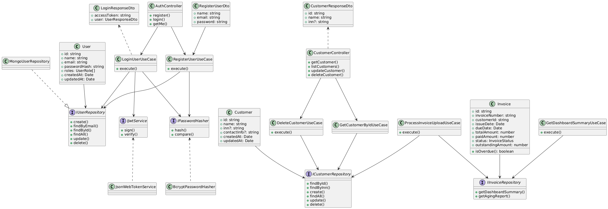
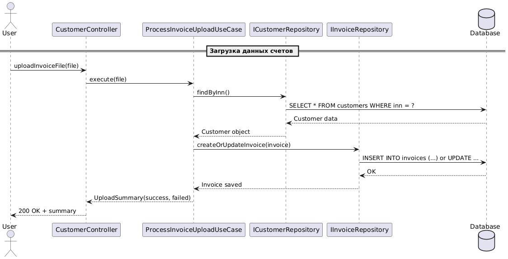
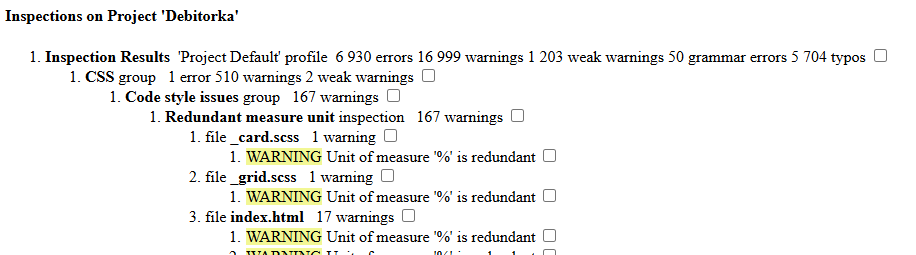
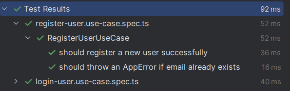
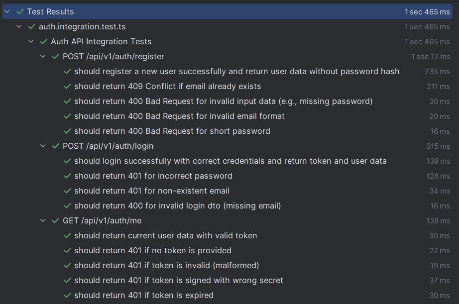

# **Программное средство реализации сервиса анализа дебиторской задолженности**

Программное средство реализации сервиса анализа дебиторской задолженности предназначено для загрузки, обработки и визуализации данных о дебиторской задолженности (ДЗ), предоставляя инструменты для её анализа и контроля.

**Сервер**: [https://github.com/AlinaShnur/ShnurAA_214371_RIOPK_Server](https://github.com/AlinaShnur/ShnurAA_214371_RIOPK_Server)  
**Клиент**: [https://github.com/AlinaShnur/ShnurAA_214371_RIOPK_Client](https://github.com/AlinaShnur/ShnurAA_214371_RIOPK_Client)

---

## **Содержание**

1. [Архитектура](#архитектура)  
2. [Функциональные возможности](#функциональные-возможности)  
3. [Детали реализации](#детали-реализации)  
4. [Тестирование](#тестирование)  
5. [Установка и запуск](#установка-и-запуск)  
6. [Лицензия](#лицензия)  
7. [Контакты](#контакты)

---

## **Архитектура**

### C4-модель

#### Контекстный уровень  


#### Контейнерный уровень  


#### Компонентный уровень  


### Схема данных  


---

## **Функциональные возможности**

### Диаграмма вариантов использования  


### User-flow диаграмма  


---

## **Детали реализации**

### UML-диаграммы

#### Диаграмма классов  


#### Диаграмма последовательностей  


### Спецификация API

Открыть в браузере:  
[http://localhost:3001/api-docs](http://localhost:3001/api-docs/)

OpenAPI YAML-файл: `openapi.json` генерируется автоматически.

### Безопасность

Использована JWT-аутентификация:
```typescript
// src/application/interfaces/IJwtService.ts

export interface JwtPayload {
    sub: string; // Subject (user ID)
    roles: string[]; // Роли пользователя
    iat?: number;
    exp?: number;
}

export interface IJwtService {
    sign(payload: Pick<JwtPayload, 'sub' | 'roles'>): Promise<string>;
    verify(token: string): Promise<JwtPayload | null>;
}

export const JwtServiceToken = Symbol('IJwtService');


### Оценка качества кода



---

## **Тестирование**

### Unit-тесты

Файл: `// tests/application/use-cases/auth/`

### Интеграционные тесты

Файл: `// tests/integration/auth.integration.test.ts`



---

## **Установка и запуск**

### Манифесты для сборки docker образов

Файл `Dockerfile`:
```dockerfile
FROM node:18
WORKDIR /usr/src/app
COPY package*.json ./
RUN npm install
COPY . .
RUN npm run build
ENV NODE_ENV=production
ENV PORT=3001
EXPOSE ${PORT}
CMD ["uvicorn", "app.main:app", "--host", "0.0.0.0", "--port", "8000"]
```

## **Лицензия**

Этот проект лицензирован по лицензии MIT – подробности в файле [LICENSE.md](LICENSE.md)

---

## **Контакты**

Автор: Алина Шнур 
Email: 8029606@gmail.com